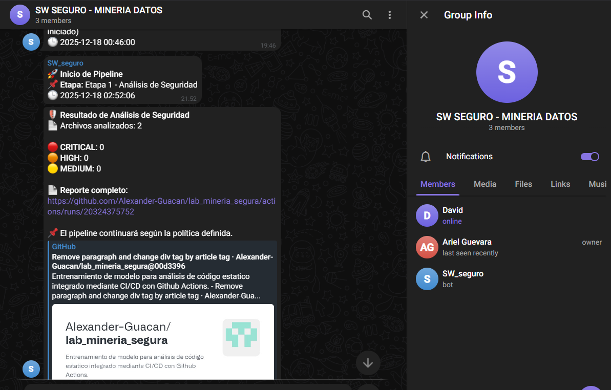

# Desarrollo e Implementación de un Pipeline CI/CD Seguro con integración de IA para la Detección Automática de Vulnerabilidades en código fuente mediante un Modelo de Minería de Datos.
### Universidad de las Fuerzas Armadas ESPE  
**Materia:** Desarrollo de Software Seguro  
**Estudiantes:** Alexander Guacán, Ariel Guevara  
**NRC:** 27894  
**Deploy:** [Sistema de Notas](https://lab-mineria-segura.vercel.app/)

---

## 📌 Descripción del Proyecto

Este laboratorio explora cómo aplicar **técnicas de minería de datos** para identificar **potenciales vulnerabilidades** en código fuente.  
El enfoque sigue la metodología **SEMMA (Sample, Explore, Modify, Model, Assess)** e integra resultados en un proceso **DevSecOps**.

El objetivo final es construir un **modelo predictivo de vulnerabilidades**, entrenarlo con un dataset basado en repositorios reales de GitHub, y posteriormente integrarlo en un pipeline de CI/CD (GitHub Actions).

---

# 🔍 Análisis Detallado: Sistema de Análisis de Seguridad Multilenguaje

## Visión General del Flujo

El sistema implementa un **pipeline de ML para detección de vulnerabilidades** en múltiples lenguajes (Python, Java, C/C++, JavaScript). El flujo crítico involucra dos scripts principales:

1. **`step3_train_multilang.py`** - Entrenamiento de modelos especializados
2. **`step4_multilang_scanner.py`** - Motor de análisis en producción

---

## � Dependencias y Clases Requeridas

### 1. **Clase `RiskKeywordCounter`** (Transformador Personalizado)

**Ubicación**: Definida en `step4_multilang_scanner.py` línea 10

```python
class RiskKeywordCounter(BaseEstimator, TransformerMixin):
    def __init__(self, keywords=[]):
        self.keywords = keywords
    
    def fit(self, X, y=None): 
        return self
    
    def transform(self, X):
        features = []
        for text in X:
            if not isinstance(text, str):
                features.append([0] * (len(self.keywords) + 1))
                continue
            text_lower = text.lower()
            # Cuenta ocurrencias de cada palabra clave de riesgo
            row = [text_lower.count(k.lower()) for k in self.keywords]
            # Feature adicional: longitud normalizada del código
            row.append(len(text) / 1000.0) 
            features.append(row)
        return np.array(features)
```

**Propósito**: 
- Extrae características basadas en palabras clave de vulnerabilidades
- Se integra en el `Pipeline` de scikit-learn
- **CRÍTICO**: Debe estar definida en el mismo espacio de nombres donde se carga el modelo con `joblib.load()`, de lo contrario fallará la deserialización

**Palabras clave por lenguaje** (definidas en `step3_train_multilang.py`):
- **Python**: `["eval", "exec", "pickle", "sql", "shell", "password", "secret"]`
- **Java**: `["Runtime.exec", "ProcessBuilder", "eval", "password", "api_key"]`
- **C/C++**: `["system", "exec", "strcpy", "gets", "scanf", "buffer"]`
- **JavaScript**: `["eval", "innerHTML", "exec", "dangerouslySetInnerHTML"]`

---

## 🔧 Componentes del Sistema

### 2. **Datasets de Entrenamiento**

**Generación de datos sintéticos**:

#### Para JavaScript: `step0_augment_js.py`
```python
templates = [
    # DOM XSS
    {"type": 1, "code": "el.innerHTML = userInput;"},  # Vulnerable
    {"type": 0, "code": "el.textContent = userInput;"},  # Seguro
    
    # Eval Injection
    {"type": 1, "code": "eval(expr);"},  # Vulnerable
    {"type": 0, "code": "parseInt(expr);"},  # Seguro
    
    # Command Injection
    {"type": 1, "code": "exec('ls ' + cmd)"},  # Vulnerable
    {"type": 0, "code": "execFile('ls', [arg])"},  # Seguro
]
```

**Salida**: `data/partitioned/dataset_js.csv`

#### Para C/C++: `step0_augment_c.py`
- Genera 10,000 muestras sintéticas
- Incluye vulnerabilidades: buffer overflow, format string, command injection
- **Salida**: `data/partitioned/dataset_c.csv`

#### Para Java: Similar estructura con vulnerabilidades específicas
- SQL Injection sin PreparedStatement
- Command Injection con Runtime.exec()
- **Salida**: `data/partitioned/dataset_java.csv`

---

### 3. **Script de Entrenamiento: `step3_train_multilang.py`**

**Arquitectura del entrenamiento**:

```python
def train_language_model(lang, dataset_path, keywords):
    # 1. Cargar dataset específico del lenguaje
    df = pd.read_csv(dataset_path)
    X = df['code']
    y = df['target']
    
    # 2. Crear pipeline híbrido
    pipeline = Pipeline([
        ('tfidf', TfidfVectorizer(
            max_features=500,
            ngram_range=(1, 2),
            token_pattern=r'\b\w+\b'
        )),
        ('keyword_counter', RiskKeywordCounter(keywords=keywords)),
        ('classifier', RandomForestClassifier(
            n_estimators=100,
            max_depth=20,
            random_state=42
        ))
    ])
    
    # 3. Entrenamiento con validación cruzada
    X_train, X_test, y_train, y_test = train_test_split(
        X, y, test_size=0.2, random_state=42, stratify=y
    )
    
    pipeline.fit(X_train, y_train)
    
    # 4. Evaluación
    y_pred = pipeline.predict(X_test)
    print(f"Accuracy: {accuracy_score(y_test, y_pred)}")
    print(f"F1-Score: {f1_score(y_test, y_pred)}")
    
    # 5. Guardar modelo serializado
    model_path = f"models/model_{lang}.pkl"
    joblib.dump(pipeline, model_path)
```

**Modelos generados**:
- `models/model_python.pkl`
- `models/model_java.pkl`
- `models/model_c_cpp.pkl`
- `models/model_javascript.pkl`

---

### 4. **Motor de Análisis: `step4_multilang_scanner.py`**

#### A. **Sistema de Mapeo de Lenguajes**

```python
LANG_MAP = {
    ".py":  "python",
    ".java": "java",
    ".c":   "c_cpp",
    ".cpp": "c_cpp",
    ".h":   "c_cpp",
    ".js":   "javascript",
    ".ts":   "javascript",
    ".jsx":  "javascript"
}
```

#### B. **Base de Reglas Heurísticas**

```python
RULES_DB = {
    "python": [
        {"id": "sql_injection", "sev": "CRITICAL", 
         "pat": r'execute\s*\(.*(\+|%|format)'},
        {"id": "command_injection", "sev": "CRITICAL", 
         "pat": r'os\.system\s*\(.*(\+|%)'},
        {"id": "hardcoded_secret", "sev": "HIGH", 
         "pat": r'(password|api_key)\s*=\s*["\'][^"\']+["\']'}
    ],
    "javascript": [
        {"id": "eval_injection", "sev": "CRITICAL", 
         "pat": r'eval\s*\('},
        {"id": "xss_react", "sev": "HIGH", 
         "pat": r'dangerouslySetInnerHTML'},
        {"id": "prototype_pollution", "sev": "HIGH", 
         "pat": r'__proto__|prototype'}
    ],
    # ... reglas para Java y C/C++
}
```

#### C. **Función de Escaneo Principal**

```python
def scan_file(filepath, lang):
    # 1. Cargar modelo ML específico del lenguaje
    model_path = os.path.join(MODEL_DIR, f"model_{lang}.pkl")
    pipeline = joblib.load(model_path)
    
    # 2. Leer código fuente
    with open(filepath, 'r', encoding='utf-8') as f:
        raw_code = f.read()
    
    # 3. ANÁLISIS ML: Predicción de probabilidad
    code_clean = clean_code(raw_code)
    ml_prob = pipeline.predict_proba([code_clean])[0][1]
    
    # 4. ANÁLISIS ESTÁTICO: Reglas heurísticas
    findings = []
    rules = RULES_DB.get(lang, [])
    for rule in rules:
        if re.search(rule["pat"], raw_code, re.IGNORECASE):
            findings.append({
                "name": rule["id"],
                "severity": rule["sev"],
                "pattern": rule["pat"]
            })
    
    # 5. SCORING HÍBRIDO
    heuristic_score = sum(
        3 if f["severity"] == "CRITICAL" else 
        2 if f["severity"] == "HIGH" else 1 
        for f in findings
    )
    
    final_score = (ml_prob * 10) + heuristic_score
    
    # 6. VEREDICTO
    if final_score > 8:
        verdict = "CRITICAL"
    elif final_score > 5:
        verdict = "HIGH"
    elif final_score > 3:
        verdict = "MEDIUM"
    else:
        verdict = "LOW"
    
    return {
        "verdict": verdict,
        "score": round(final_score, 2),
        "ml_prob": round(ml_prob, 3),
        "findings": findings
    }
```

---

## 🔄 Flujo de Ejecución Completo

### **Fase 1: Preparación de Datos**
```bash
# Generar datasets sintéticos
python model/step0_augment_js.py
python model/step0_augment_c.py
# (Similar para Java)
```

### **Fase 2: Entrenamiento**
```bash
python model/step3_train_multilang.py
```

**Salida esperada**:
```
--- ENTRENANDO MODELO: python ---
Dataset cargado: 12543 muestras
Accuracy: 0.94
F1-Score: 0.92
✅ Modelo guardado: models/model_python.pkl

--- ENTRENANDO MODELO: javascript ---
...
```

### **Fase 3: Análisis de Archivos**
```bash
python model/step4_multilang_scanner.py
```

**Proceso interno**:
```python
def run_multilang_scan():
    full_report = {}
    files = os.listdir(TEST_DIR)  # ../tests/
    
    for filename in files:
        ext = os.path.splitext(filename)[1].lower()
        if ext in LANG_MAP:
            lang = LANG_MAP[ext]
            result = scan_file(os.path.join(TEST_DIR, filename), lang)
            full_report[filename] = result
    
    # Guardar reporte JSON
    with open("multilang_security_report.json", "w") as f:
        json.dump(full_report, f, indent=4)
```

**Ejemplo de reporte** (`multilang_security_report.json`):
```json
{
  "vulnerable_ping.js": {
    "verdict": "CRITICAL",
    "score": 12.4,
    "ml_prob": 0.892,
    "findings": [
      {
        "name": "command_injection",
        "severity": "CRITICAL",
        "pattern": "exec.*\\+"
      }
    ]
  },
  "SafeApp.java": {
    "verdict": "LOW",
    "score": 1.2,
    "ml_prob": 0.120,
    "findings": []
  }
}
```

---

## 📊 Visualización: `step5_visualize_report.py`

```python
def print_dashboard():
    with open("multilang_security_report.json") as f:
        data = json.load(f)
    
    for filename, report in data.items():
        verdict = report["verdict"]
        
        # Colorización según nivel de riesgo
        if verdict in ["CRITICAL", "HIGH"]:
            color = Colors.FAIL  # Rojo
            icon = "🔴"
        elif verdict == "MEDIUM":
            color = Colors.WARNING  # Amarillo
            icon = "🟠"
        else:
            color = Colors.GREEN  # Verde
            icon = "🟢"
        
        print(f"{color}{icon} {filename}: {verdict}{Colors.ENDC}")
        print(f"   Score: {report['score']}")
        print(f"   Hallazgos: {len(report['findings'])}")
```

---

## 🚨 Puntos Críticos de Integración

### **1. Importancia de `RiskKeywordCounter`**
- **Debe estar definida** en cualquier script que cargue modelos con `joblib.load()`
- Scikit-learn serializa referencias a clases, no su código
- **Error común**: `AttributeError: Can't get attribute 'RiskKeywordCounter'`

### **2. Estructura de Directorios Requerida**
```
model/
├── models/
│   ├── model_python.pkl
│   ├── model_java.pkl
│   ├── model_c_cpp.pkl
│   └── model_javascript.pkl
├── data/partitioned/
│   ├── dataset_js.csv
│   ├── dataset_java.csv
│   └── dataset_c.csv
└── multilang_security_report.json
```

### **3. Dependencias de Python**
```python
# requirements.txt
pandas>=1.3.0
numpy>=1.21.0
scikit-learn>=1.0.0
joblib>=1.1.0
```

---

## 🔍 Análisis de Componentes Auxiliares

### **Función `clean_code()`** (línea 67 en `step4_multilang_scanner.py`)
```python
def clean_code(text):
    # Eliminar comentarios
    text = re.sub(r'//.*|/\*.*?\*/', '', text, flags=re.DOTALL)
    text = re.sub(r'#.*', '', text)
    
    # Normalizar espacios
    text = text.replace('\n', ' ').replace('\t', ' ')
    
    # Eliminar caracteres especiales excepto sintaxis de código
    text = re.sub(r'[^A-Za-z0-9\s\(\)\[\]\{\}\.\_\=\-\"\']', '', text)
    
    return text.strip()
```

**Propósito**: Estandarizar código antes de análisis ML para:
- Reducir ruido
- Mejorar eficacia de TF-IDF
- Homogeneizar diferentes estilos de programación

---

## 📈 Métricas de Evaluación (desde `model_training.py`)

```python
def evaluate_model(name, model, X_test, y_test):
    preds = model.predict(X_test)
    print(f"\n=== Resultados: {name} ===")
    print("Accuracy:", accuracy_score(y_test, preds))
    print("Precision:", precision_score(y_test, preds))
    print("Recall:", recall_score(y_test, preds))
    print("F1:", f1_score(y_test, preds))
```

**Métricas esperadas**:
- **Accuracy**: >90% (precisión general)
- **Recall**: >85% (minimizar falsos negativos)
- **F1-Score**: Balance entre precisión y recall

---

## 🛡️ Sistema de Reglas por Lenguaje

### **Python** (desde `step4_multilang_scanner.py`)
```python
{
    "sql_injection": r'execute.*(\+|%|format)',
    "command_injection": r'os\.system.*(\+|%)',
    "deserialization": r'pickle\.loads?',
    "hardcoded_secret": r'(password|api_key)\s*=\s*["\'][^"\']+["\']'
}
```

### **JavaScript**
```python
{
    "eval_injection": r'eval\s*\(',
    "cmd_injection": r'(exec|spawn).*(\+|`|\$\{)',
    "xss_react": r'dangerouslySetInnerHTML',
    "prototype_pollution": r'__proto__|prototype'
}
```

---

## ✅ Checklist de Ejecución

1. ☑️ Instalar dependencias: `pip install -r requirements.txt`
2. ☑️ Ejecutar generadores de datos: `step0_augment_*.py`
3. ☑️ Entrenar modelos: `step3_train_multilang.py`
4. ☑️ Verificar existencia de `.pkl` en `models/`
5. ☑️ Colocar archivos a analizar en `../tests/`
6. ☑️ Ejecutar scanner: `step4_multilang_scanner.py`
7. ☑️ Visualizar resultados: `step5_visualize_report.py`

---

## 🔗 Referencias Cruzadas

- Pipeline completo: `main.py`
- Heurísticas Python: `heuristics.py`
- Análisis de repositorios: `analyze_repo.py`
- Integración CI/CD: `.github/workflows/code_risk.yml`

---

## �📁 Estructura del Proyecto

lab_mineria_segura/
│── data/
│ ├── raw/ # Repos descargados (IGNORADOS EN GIT)
│ ├── commits/ # Commits descargados de la API (IGNORADOS EN GIT)
│ └── meta/ # Datasets generados durante el análisis
│
│── src/
│ ├── download_sample.py # Script Día 2 – SEMMA: Sample
│ └── extract_features.py # (Se desarrollará en el Día 3)
│
│── notebooks/ # Exploraciones Jupyter opcionales
│── docs/ # Documentación del proyecto
│── .gitignore
│── README.md

---

## 📊 Repositorios Analizados

Los datos provienen de cuatro repositorios representativos y ampliamente utilizados:

- `scrapy/scrapy`
- `fastapi/fastapi`
- `pandas-dev/pandas`
- `python/cpython`

Estos repos permiten generar una muestra variada en complejidad, arquitectura y estilos de código.

---

## ⚙️ Requisitos técnicos

- Python 3.10+
- Git
- Librerías:
pandas
numpy
scikit-learn
requests
gitpython
radon
tqdm

---

## 🧑‍💻 Cómo ejecutar

1. Clonar este repositorio  
2. Crear el entorno virtual
 ```bash
 python -m venv .venv
 ```
3. Activar entorno virtual
 ```bash
 # Windows (cmd)
 .venv\Scripts\activate
 ```

 ```bash
 # Windows (Powershell)
 .venv\Scripts\Activate.ps1
 ```

 ```bash
 # Linux/MacOS
 source .venv/bin/activate
 ```
4. Instalar dependencias
 ```bash
 pip install -r requirements.txt
 ```
5. Ejecutar:
 ```bash
 python src/download_sample.py
 ```

 ```bash
 python src/extract_features.py
 ```
6. Verificar datasets generados en:
data/meta/

## Guía de Uso del Modelo Implementado

Este proyecto permite analizar riesgos de seguridad en código fuente utilizando un modelo de machine learning entrenado con datasets de vulnerabilidades. A continuación, se describen los pasos para usar las clases y scripts principales:

---

### 1. Descargar el Dataset de CVEFixes
El script `download_cvefixes.py` descarga el dataset de vulnerabilidades desde fuentes oficiales.

#### Uso:
```bash
python src/download_cvefixes.py
```

#### Qué hace:
- Descarga el archivo `CVEfixes.csv` desde el repositorio oficial o Kaggle.
- Guarda los datos en la carpeta `data/cvefixes/raw/`.

---

### 2. Procesar el Dataset de Kaggle
El script `process_kaggle_dataset.py` procesa el dataset descargado desde Kaggle para convertirlo en un formato compatible con el modelo.

#### Uso:
```bash
python src/process_kaggle_dataset.py
```

#### Qué hace:
- Limpia y transforma los datos del dataset de Kaggle.
- Genera un archivo procesado en `data/cvefixes/processed/`.

---

### 3. Integrar Datasets
El script `integrate_datasets.py` combina múltiples datasets (como CVEFixes y Kaggle) en un único dataset integrado.

#### Uso:
```bash
python src/integrate_datasets.py
```

#### Qué hace:
- Combina los datasets procesados en un único archivo `dataset_integrated.csv`.
- Guarda el archivo integrado en `data/meta/`.

---

### 4. Entrenar el Modelo
El script `train_integrated_model.py` entrena un modelo de machine learning utilizando el dataset integrado.

#### Uso:
```bash
python src/train_integrated_model.py
```

#### Qué hace:
- Entrena un modelo con los datos de `dataset_integrated.csv`.
- Guarda el modelo entrenado en `data/meta/best_model.pkl`.
- Genera un archivo de metadatos del modelo en `data/results/model_metadata.json`.

---

### 5. Probar el Modelo
El script `src/test_model.py` permite probar el modelo entrenado con archivos de código fuente.

#### Uso:
```bash
python src/test_model.py <archivo.py>
```

#### Ejemplo:
```bash
python src/test_model.py tests/vulnerable_code.py
```

#### Qué hace:
- Extrae características del archivo de código.
- Predice la probabilidad de que el archivo sea vulnerable.
- Muestra un resumen con la clasificación y las probabilidades.

#### Salida esperada:
```plaintext
====================================================================
PROBANDO MODELO EN: tests/vulnerable_code.py
====================================================================

📊 Información del modelo:
   Tipo: gradient_boosting
   Precisión (CV): 99.97%
   Precisión (Test): 99.92%
   F1-Score: 99.92%
   AUC: 99.92%

🔍 Extrayendo características del archivo...

📈 Características extraídas:
   loc: 62
   comments: 11
   functions: 6
   classes: 0
   imports: 3
   ast_nodes: 201
   control_structures: 5
   cyclomatic_complexity: 7
   maintainability_index: 82.75
   size_bytes: 1983

====================================================================
RESULTADO DE LA PREDICCIÓN
====================================================================

🎯 Clasificación: ⚠️ VULNERABLE
📊 Probabilidad de ser SEGURO: 0.00%
📊 Probabilidad de ser VULNERABLE: 100.00%

💡 Interpretación:
   🔴 ALTO RIESGO - Revisar urgentemente
```

---

### Resumen del Flujo Completo
1. **Descargar el dataset:** `download_cvefixes.py`
2. **Procesar el dataset de Kaggle:** `process_kaggle_dataset.py`
3. **Integrar datasets:** `integrate_datasets.py`
4. **Entrenar el modelo:** `train_integrated_model.py`
5. **Probar el modelo:** `src/test_model.py`

---

### Notas Adicionales
- Asegúrate de instalar las dependencias del proyecto antes de ejecutar los scripts:
  ```bash
  pip install -r requirements.txt
  ```
- Los resultados del modelo se guardan en la carpeta `data/results/`.


### Anexos

#### Chatbot de Telegram



## 📄 Licencia

Proyecto académico — uso educativo.